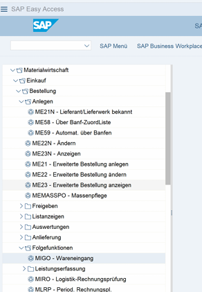

# 🟦SAP S/4HANA: My University Lab Records.
**Grade: 1.0** | Projects from my Bachelor at Trier University of Applied Sciences.

## 📖 What is This?
I created this repository to keep a record of what I learned in my SAP modules. I didn't want to lose the knowledge just because the university semester ended.
These notes are based on the practical lab work I did using the "Global Bike" system. It shows that I understand how the system is put together and how the business data flows.

## 🖥️ Modern SAP: The Fiori Experience
I spent the majority of my lab time working within the **SAP Fiori** environment. It's huge shift from the classic SAP GUI. It moves the focus from "Transaction Codes" to User Experience."

*Note: This is the SAP Fiori Launchpad I used for my Bachelor labs. It uses role-based "Tiles" for different business tasks, which is the standard interface for S/4HANA.*

## Getting my hands dirty with the technical stuff
The part that actually kept me busy wasn't just using the system, but setting it up. I followed the manuals to build a company from scratch, and it taught me a lot about what happens "under the hood."

### 1. Setting up the Company (Customizing)
I followed the lab manuals to build a company structure. I practiced creating the "basics" that a company needs to run:
* Defining the **Company Code** and **Plants**
* Linking the storage locations so the system knows where the inventory is.
* Setting up the **Material Ledger**. In S/4HANA, you can't just skip this. I had to dive into the technical settings (transactions like **OMX1** and **OMX3**) and then run the productive start (**CKMSTART**). I’ll be honest: getting those status lights to turn green was a bit of a relief. Without that, you can't even move a single bike in the system (the **MIGO** transaction just fails). It showed me how sensitive the system is. One wrong setting in the background and the whole warehouse stops.

### 2. Running the Business Cycles
Once the system was "alive", I practiced the standard flows. This is where I learned that you can't do anything without proper **Master Data** (Business Partners and Material Masters) first,
I spent a lot of time practicing the standard "demo" flows:
* **Purchasing (Procure-to-Pay):** Creating Purchase Orders,  doing the Goods Receipt (MIGO), and checking the vendor invoices.
* **Sales:** Handling customer orders and seeing how the system checks if we have enough bikes in stock.

## ⚡When finally it clicked
The coolest part for me was seeing the "chain reaction" after basic **Goods Receipt**. On the screen, I was just clickign a button to say "the bikes have arrived." But because the background setup was correct, I could see the system tlaking to itself.
* The warehouse stock updated immediately.
* A hidden accounting document was created.
* The company's financial balance sheet updated its value in real-time.

Realizing that the warehouse and the finance office are basically "talking" to each other through these links is what made the course interesting for me. 
It’s not just data entry; it’s seeing how a massive business actually stays in sync.
